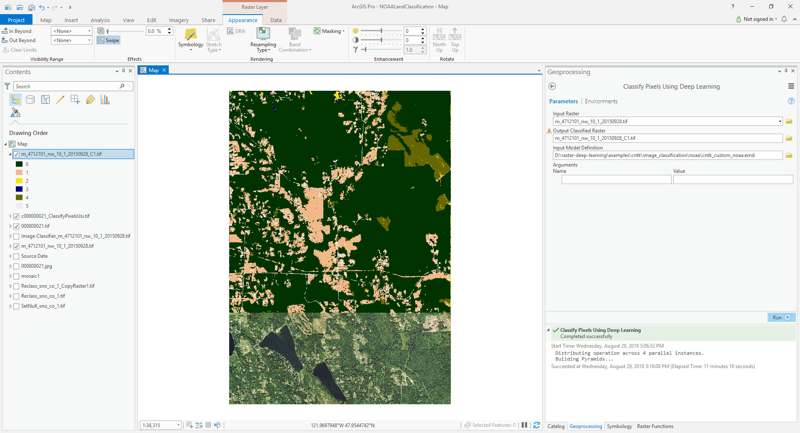

# Azure Pixel-level Land Classification Example using CNTK in ArcGIS Pro
Step 1. Open "Classify Pixels Using Deep Learning" geoprocessing tool.

Step 2. Fill in the parameters.

| Parameter | Value |
| --------- | ----- |
| Input Raster | "images\m_4712101_nw_10_1_20150928.tif" |
| Input Model Definition File | azure_pixel_level_land_classification.emd |

Step 3. Run the tool.

