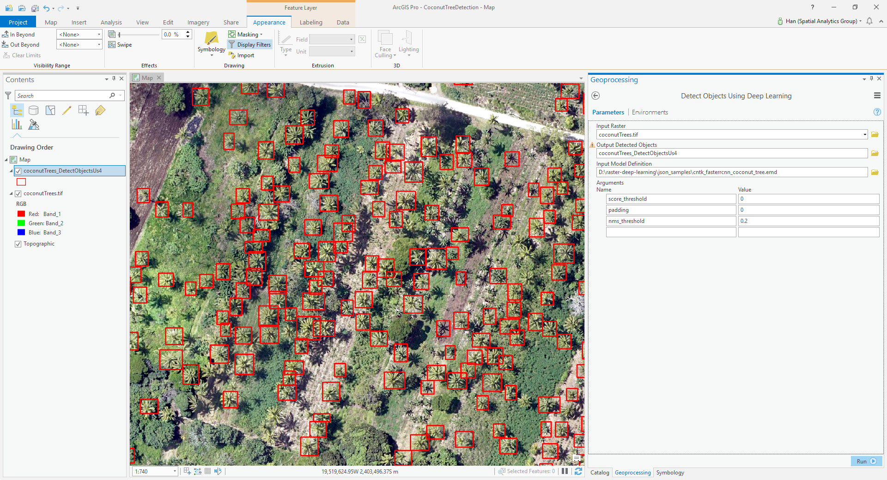

# CNTK Coconut Tree Detection Example in ArcGIS Pro
Step 0. Download the test deep learning model and image [here](https://www.arcgis.com/home/item.html?id=a75a2b1086774525ac46370c5f4c1fdd).
You can also use your own trained model and test image.

Step 1. Open "Detect Object Using Deep Learning" geoprocessing tool. 

Step 2. Fill in the parameters. 

| Parameter | Value |
| --------- | ----- |
| Input Raster | "images\coconutTrees.tif" |
| Input Model Definition File | cntk_fasterrcnn_cocnut_tree.emd |
| Arguments | score_threshold:0.0, padding:0, nms_threshold:0.2|

Step 3. Run the tool.

