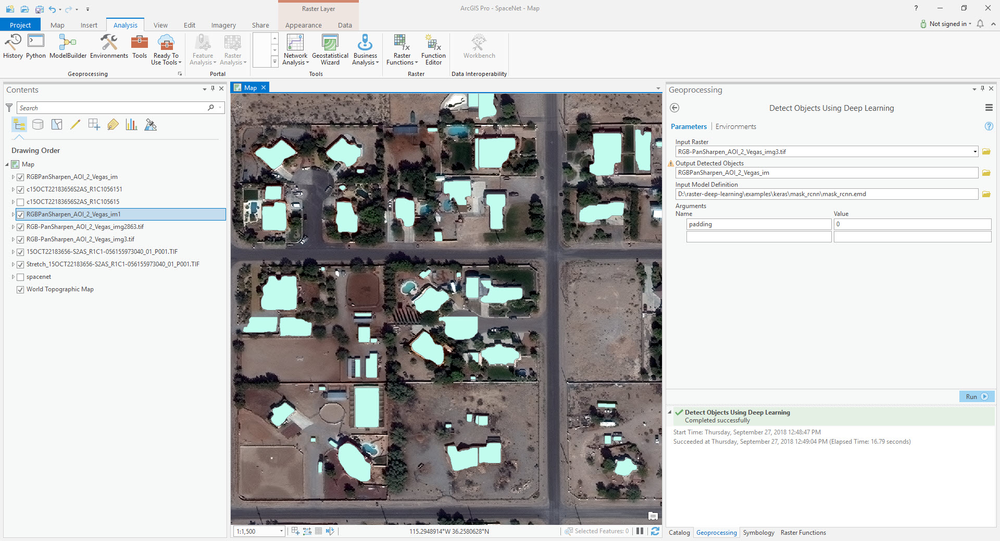

# Keras Mask RCNN House Footprints Example in ArcGIS Pro
Step 1. Open "Detect Object Using Deep Learning"

Step 2. Fill in the parameters

| Parameter | Value |
| --------- | ----- |
| Input Raster | "images\15OCT22183656-S2AS_R1C1-056155973040_01_P001.TIF" |
| Input Model Definition File | mask_rcnn_spacenet.emd |
| Arguments | padding:0 |

Step 3. Run the tool.

