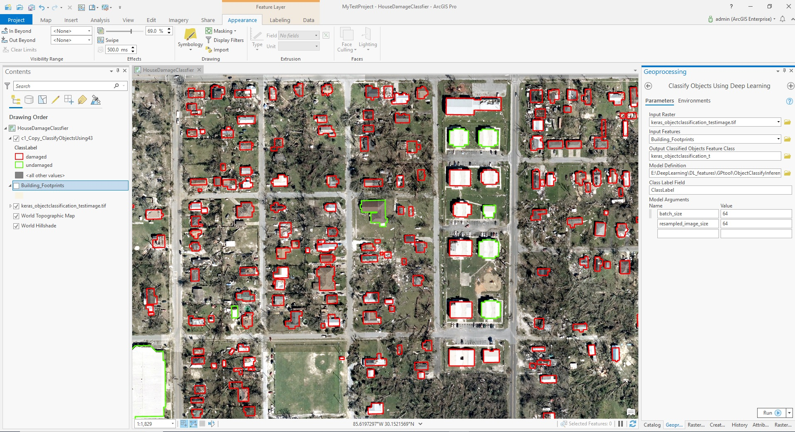

# Keras House Damage Classification Example in ArcGIS Pro
Step 0. Download test deep learning model, input image, input features from the link [here](https://www.arcgis.com/home/item.html?id=8549fbf2be404e678934d224f9804298).
You can also use your own trained model and test image. 

Step 1. Open "Classify Object Using Deep Learning"

Step 2. Fill in the parameters

| Parameter | Value |
| --------- | ----- |
| Input Raster | inputs/keras_objectclassification_testimage.tif |
| Input Features | inputs/data.gdb/Building_Footprints
| Input Model Definition File | model/HouseDamageClassifier_ProBuiltin.emd |
| Arguments | batch_size:64; resampled_image_size:64|

Step 3. Run the tool.

