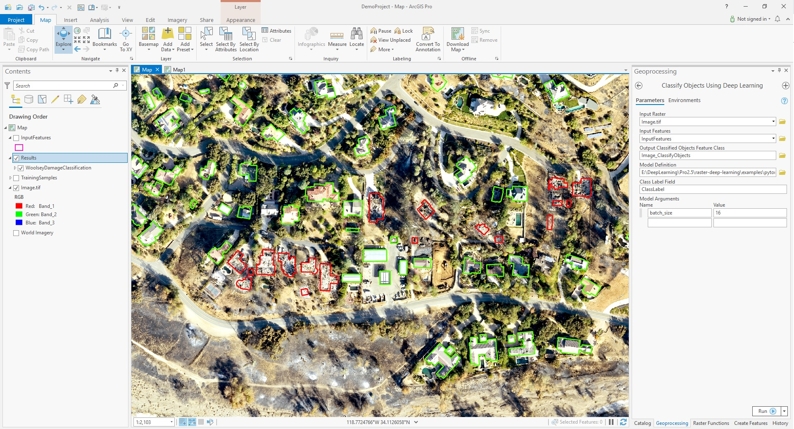

# PyTorch Building Damage Classification Example in ArcGIS Pro
Step 0. Download test deep learning model, image and input feature class from the link (TBD).
You can use Train Deep Learning Model geoprocessing tool to train your own deep learning model, specify the model type as "FeatureClassifier".

Step 1. Open "Classify Object Using Deep Learning" geoprocessing tool. 

Step 2. Fill in the parameters.

| Parameter | Value |
| --------- | ----- |
| Input Raster | inputs/image.jpg |
| Input Features | inputs/DemoProject.gdb/InputFeatures |
| Input Model Definition File | model/woolseyFire_600_50.emd |
| Arguments | batch_size:16|
Step 3. Run the GP tool.

