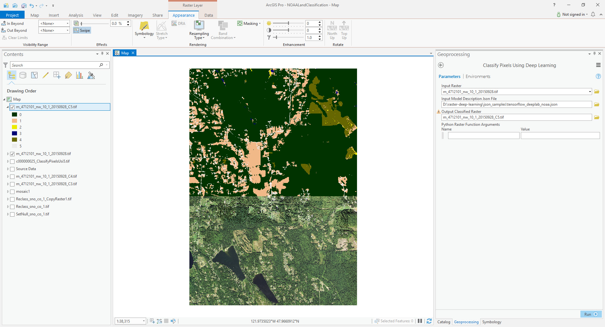

# TensorFlow Tree Detection Example in ArcGIS Pro
Step 0. Download the test deep learning model and image [here](https://www.arcgis.com/home/item.html?id=47631bf61aad46ae90f91f80707c129c).
You can also use your own trained model and test image.

Step 1. Open "Classify Pixels Using Deep Learning" geoprocessing tool.

Step 2. Fill in the parameters.

| Parameter | Value |
| --------- | ----- |
| Input Raster | "images\m_4712101_nw_10_1_20150928.tif" |
| Input Model Definition File | tensorflow_deeplab_landclassification.emd |
Step 3. Run the tool.

