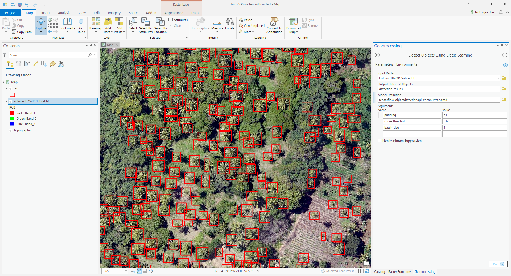

# TensorFlow Coconut Tree Detection Example in ArcGIS Pro
Step 0. Download the test deep learning model and image [here](https://www.arcgis.com/home/item.html?id=9e45c7ba200c4f1ea1379983c3ef23d8).
You can also use your own trained model and test image.

Step 1. Open "Detect Object Using Deep Learning" geoprocessing tool. 

Step 2. Fill in the parameters.

| Parameter | Value |
| --------- | ----- |
| Input Raster | "images\Kolovai_UAV4R_Subset.tif" |
| Input Model Definition File | tensorflow_objectdetectionapi_coconuttree.emd |
| Arguments | padding:64,score_threshold:0.6,batch_size:1 |

Step 3. Run the tool.

